# RNA-seq differential expression and functional analysis of *Saccharomyces cerevisiae* during sherry biofilm development

## Introduction

The development of RNA-seq and modern transcriptomics workflows has created seismic shifts in our  understanding of the complexities of eukaryotic genomes. Unlike previous technologies, RNA-seq can detect transcripts when no corresponding genomic sequence exists, and has relatively low background noise compared to microarray technology (1, 2). In particular, the analysis of RNA-seq data in fermenting organisms such as *Saccharomyces cerevisiae* has advanced food science by highlighting unique genomic features that impact functionality (2, 3). Furthermore, these advancements support the exploration of community dynamics through metatranscriptomics in food ecosystems (2, 4). However, despite its analytical power, RNA-seq requires carefully tailored bioinformatic workflows to mitigate inaccuracies in transcript alignment and quantification, statistical testing, and functional enrichment analysis (2, 5).

Both splice-aware and pseudoalignment are effective for processing RNA-seq reads, but selecting the appropriate method depends on the specific goals of the analysis. Splice-aware alignment is typically employed for its accuracy in reporting transcript abundances when compared to ground-truth values and identifying novel isoforms and splice junctions; however, it is resource-intensive (6, 7). Pseudoalignment is considered an alternative approach to traditional splice-aware mapping because it estimates transcript abundances without comparing reads per nucleotide (6, 7). While pseudoalignment is more efficient and precise, it has shown to be relatively less accurate and may be less suitable for detecting novel isoforms. Interestingly, statistical comparisons of RNA-seq analysis pipelines revealed no significant differences in accuracy or precision of raw gene expression quantification (6). Since this analysis uses RNA-seq reads from a well-annotated reference transcriptome for differential expression and functional enrichment analyses while optimizing computational efficiency, pseudoalignment was selected as the appropriate method.

Currently, several pseudoalignment tools are available for transcript quantification, with Salmon (8) and kallisto (9) among the most widely used. Evaluating these tools requires assessing accuracy with ground-truth experiments and realistic data. In a comparison study between alignment tools, both Salmon and kallisto achieved a correlation coefficient of approximately 0.95 with the truth when tested on idealized data containing no SNPs, indels, errors, or intron signal (10). Interestingly, when assessed for accuracy against realistic data containing variants, error, intron signal, and non-uniform coverage across isoforms, Salmon obtained a correlation coefficient of approximately 0.87, while kallisto dropped to 0.80 (10). Moreover, incorporating decoy sequences to account for mismatches between genomic reads and the reference transcriptome has been shown to improve Salmon’s accuracy and correlation with results from splice-aware aligners such as Bowtie2 (11, 12). Overall, Salmon’s superior accuracy and error-correction features make it the preferred choice for this study.

Beyond alignment, differential gene expression (DGE) analysis requires careful selection of methods that appropriately model transcript counts. DESeq2 (13) and edgeR (14) are commonly used tools that are effective for different use cases. When compared, both DESeq2 and edgeR were stable at different replicate numbers, but edgeR maximized the area under the ROC curves with unbalanced sequencing depths (15). Interestingly, DESeq2 was more conservative in identifying differentially expressed genes, while edgeR consistently reported the most, inflating false positives (15). Additionally, DESeq2 is more streamlined and includes automatic normalization, but edgeR is more flexible. Here, DESeq2 was selected for differential gene expression analysis due to its conservative nature and ease of use.

*S. cerevisiae* is both culturally and industrially important for its use in bread, beer, and wine production, and for its well-characterized, relatively small eukaryotic genome (16). Understanding the genes, processes, and pathways that are active during fermentation is key to optimizing these products. Additionally, *S. cerevisiae* serves as a powerful model organism for transcriptomic studies due to its compact, well-characterized genome and moderate intron content (16, 17).

​The aims of this analysis are to evaluate an appropriate workflow RNA-seq analysis of *S. cerevisiae* and perform a functional assessment of the biological changes occurring during fermentation process in sherry production. The data was obtained from Eldarov and colleagues’ 2018 study of three flor yeast strains across biofilm development stages (18). The workflow is based on a 2025 review by Dawadi and colleagues discussing a practical guide to RNA sequencing data analysis (7), and methodology for gene-level abundance inference proposed by Soneson, Love, and Robinson in 2015 (19). RNA-seq reads were extracted from BioProject PRJNA592304, with Entrez-Direct (20) and SRA Toolkit (21). The reference genome, transcriptome and annotation files were taken from the NCBI RefSeq database (GCF_000146045.2_R64). While the flor yeast strain may differ from the reference assembly, the standardized formatting and annotation were selected to ensure compatibility with downstream DGE tools. Prior to transcript quantification, FastQC (22) and MultiQC (23) were used for read quality assessment before and after filtering with Fastp (24). Trimming was not conducted because pseudoalignment permits soft-clipping residual adapters, and per-base quality trimming has been shown to dilute downstream analytical power (7, 25, 26). Salmon (8) was used in its default quasi-mapping form to quantify transcripts from 9 samples across 3 biofilm stages. Selective alignment was implemented by incorporating decoy sequences to increase the accuracy of transcript mapping (27). Differential gene expression analysis and functional enrichment were performed in R (28). DGE was conducted using DESeq2 (13), including log2 fold-change shrinkage and visualization of expression patterns. Functional over-representation analysis (ORA) was carried out to identify enriched biological processes and metabolic pathways based on Gene Ontology (GO, 29) and Kyoto Encyclopedia of Genes and Genomes (KEGG, 30) annotations. All analyses in R were implemented using the tximport (19), DESeq2 (13), clusterProfiler (31), enrichplot (32), apeglm (33), rtracklayer (34), pheatmap (35), tidyverse (36), and the S. cerevisiae annotation database (org.Sc.sgd.db, 37) packages.

## Methods

### *Computational Resources*
All analyses were conducted on a local Apple MacBook Pro (M4 architecture). Conda v25.7.0 (38) was used to manage virtual environments and dependencies.

### *Data Acquisition*
The *S. cerevisiae* S288C reference genome, transcriptome, and annotation (GCF_000146045.2) were obtained from the NCBI RefSeq database. The `esearch` and `efetch` tools from Entrez Direct v25.1 (20) were used to retrieve SRR accession numbers from BioProject PRJNA592304, and `prefetch` and `fasterq-dump` from SRA Toolkit v3.2.1 (21) were used to download and convert SRA files to FASTQ format.

### *Quality Control*
Quality assessment of reads was conducted for each sample with FastQC v0.12.1 (22) and consolidated into a single report with MultiQC v1.33 (23) before and after filtering reads. Fastp v1.1.0 (24) was run in parallel mode using `parallel.py` with `--qualified_quality_phred 30` and `--unqualified_percent_limit 20` to remove reads with more than 20 percent of bases with Phred scores below 30. The `--disable_length_filtering` and `--disable_adapter_trimming` options were used because results from MultiQC confirmed all reads were 50 base-pairs in length, and that adapter content was low. Downstream, Salmon v1.10.3 (8) with `--softclip` was used to handle adapter sequences.

### *Gene Expression Quantification*
Decoy sequences were extracted from the reference genome and concatenated with the reference transcriptome following Salmon documentation (27). Next, `salmon index` was run without the `--gencode` option because the reference genome did not contain Gencode metadata. For quantification, `salmon quant` was run following the documentation (39) with `--validateMappings` enabled to perform selective alignment against the decoy sequences. The `--softclip` option was used to permit soft-clipping of mismatched read ends during selective alignment to mitigate residual adapter sequences interfering with mapping accuracy.

### *Statistical Analysis and Visualization of Differentially Expressed Genes*
DGE was conducted in R v4.5.1 (28). A gene mapping was generated with the Bioconductor S. cerevisiae annotation database v3.21.0 (37), extracting ORF, ENTREZID and GENENAME fields for compatibility with functional enrichment analysis tools. Transcript-level abundance estimates from Salmon were summarized to gene counts using tximport v1.36.1 (19), and differential gene expression analysis across the early, thin, and mature biofilm stages was performed with DESeq2 v1.48.2 (13). Log2 fold-change shrinkage was performed with `lfcShrink` from DESeq2 with the apeglm method v1.30.0 (33). Since DESeq2 reports contrasts relative to a reference level, the design factor was re-leveled to obtain shrinkage estimates for all pairwise comparisons between biofilm development stages. Visualizations were created with ggplot2 v4.0.2 (40) and pheatmap v1.0.13 (35).

### *Functional Enrichment Analysis (ORA)*
ORA was also conducted in R. The `compareCluster` function from the clusterProfiler package v4.16.0 (31) was used for functional enrichment analysis across the biofilm development stages. The `enrichGO` and `enrichKEGG` options were used to compare GO biological processes (29) and KEGG metabolic pathways (30) that are overrepresented between clusters. For GO processes, ENTREZID names were required for matching genes, while KEGG pathways required ORF names for this process. Visualizations of the enrichment for both annotation databases were generated using enrichplot v1.28.4 (32).

### *Pipeline*

```mermaid
graph LR
    %% Data Acquisition
    subgraph Data [Data Acquisition & Quality Assessment]
        A[Entrez Direct / SRA Toolkit] --> B[Raw FASTQ Files]
        B --> C[FastQC / MultiQC]
        C --> D[Fastp Filtering]
    end

    %% Quantification
    subgraph Quant [Quantification]
        E[RefSeq Genome & Transcriptome] --> F[Build Salmon Index with Decoys]
        D --> G[Salmon Selective Alignment]
        F --> G
    end

    %% DGE Analysis
    subgraph DGE [Differential Expression]
        G --> H[tximport: Transcript to Gene Counts]
        H --> I[DESeq2 DGE Analysis]
        I --> J[lfcShrink: Apeglm]
        J --> K[Visualization: ggplot2 / pheatmap]
    end

    %% Functional Enrichment
    subgraph ORA [Functional Enrichment]
        K --> L[clusterProfiler]
        L --> M[enrichGO & enrichKEGG]
        M --> N[Visualization: enrichplot / ggplot2]
    end
```

Figure 1. Workflow used for transcript quantification, differential gene expression and functional enrichment analyse to assess functional changes in *Saccharomyces cerevisiae* samples across biofilm development stages.

